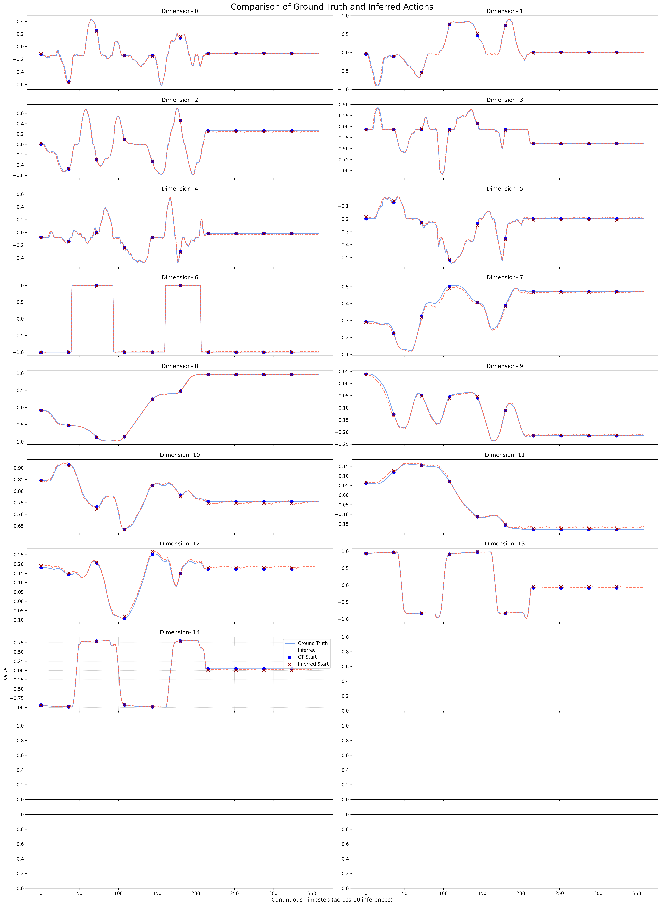

# Genie Envisioner: A Unified World Foundation Platform for Robotic Manipulation

## Performance of GE-Act on LIBERO

|  Split | Goal | Object | 10   | Spatial | Average |
|  ----  | ---- | ----   | ---- | ----    | ----    |
| Success Rate | 0.958 | 0.976 | 0.944 | 0.982 | 0.965 |


## Evaluating on LIBERO

1. Download [the weights of GE-Act trained on LIBERO dataset](https://modelscope.cn/models/agibot_world/Genie-Envisioner/files)

2. Modify the path of checkpoints in ``experiments/eval_libero.sh``

3. Modify the path ``pretrained_model_name_or_path`` in ``configs/ltx_model/libero/action_model_libero.yaml``

3. Run
    ```
    bash experiments/eval_libero.sh
    ```

## Training on LIBERO

### Prepare Dataset

1. Download LIBERO dataset from
    ```
    https://huggingface.co/datasets/openvla/modified_libero_rlds
    ```

2. Convert LIBERO Dataset to LEROBOT-format following
    ```
    https://github.com/Physical-Intelligence/openpi/blob/main/examples/libero/convert_libero_data_to_lerobot.py
    ```


### Prepare action and state statistics

1. You can use the statistic file provided in ``configs/ltx_model/libero/libero_all.json``. 

2. (Optional) If you want to create your own statistic file, you can run the script as bellow.
    ```
    python scripts/get_statistics.py --data_root PATH/TO/YOUR/DATASET --data_name libero --data_type eef --action_key actions --state_key state --save_path PATH/OF/FILE.json
    ```

### Task-specific video adaption

1. Modify the path in ``configs/ltx_model/libero/video_model_lerobot.yaml``.

2. Run
    ```
    bash scripts/train.sh main.py configs/ltx_model/libero/video_model_lerobot.yaml
    ```

### Action Post-Training

1. Modify the path in ``configs/ltx_model/libero/action_model_lerobot.yaml``.

2. Run
    ```
    bash scripts/train.sh main.py configs/ltx_model/action_model_lerobot.yaml
    ```

3. After training, the model should fit the **training data** well on the open-loop validation plot. For example, the figure below shows the open-loop accuracy of GE-Act trained on libero-10 for 50,000 steps with total batch size of 128.



